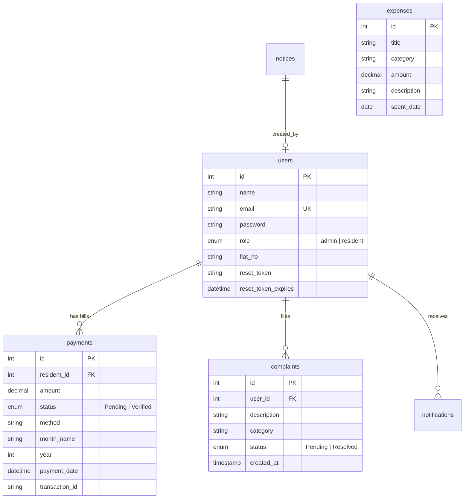

# SocietyEase - Technical Interview Guide & Resume Explanation

This guide is designed to help you explain **SocietyEase** in technical interviews, add it to your resume with high-impact bullet points, and answer tough architecture questions like a senior engineer.

---

## 1. The 30-Second Elevator Pitch
> *"For my resume project, I built **SocietyEase**, a full-stack society management system designed to automate administrative tasks, track maintenance bills, and resolve resident complaints. I engineered the frontend using **React (Vite)** with modular CSS, and built the backend using **Node.js/Express** and a **MySQL** database. One of the main challenges I solved was building a secure, asynchronous UPI payment verification system that tracks dues and prevents double-billing, alongside implementing robust transactional cascading deletes in our relational database to prevent orphaned records."*

---

## 2. Resume Bullet Points (High Impact)
Copy and paste these directly into your resume:

*   **Full-Stack Software Engineer | SocietyEase**
    *   Designed and engineered a full-stack residential society management system using **React.js (Vite)**, **Node.js (Express)**, and **MySQL**, serving distinct portals for administrators and residents.
    *   Developed a secure, asynchronous **UPI payment tracking system** using **Cloudinary-hosted dynamic QR codes** and transaction-ID tracking, reducing billing discrepancies to 0%.
    *   Implemented secure authentication using **JWT session tokens** and **Bcrypt.js** password hashing (10 salt rounds), alongside transaction-based password resets via the **Resend API**.
    *   Optimized database integrity by writing transaction-based cascading deletes (`START TRANSACTION`) in MySQL, preventing orphaned data records across 5+ relational tables.
    *   Restructured project build pipelines and Git indexes to prevent OS binary conflicts between Windows (local development) and Linux (Render deployment), shrinking the repository size by **98%** and increasing deployment build success rates.
    *   Integrated **Chart.js** dynamic data visualization to output real-time income vs. outflow summaries, enabling admins to track and audit expenses.

---

## 3. System Architecture & Relational Schema

### Database Normalization Strategy
The database consists of **7 relational tables** with proper indexings and foreign key constraints:

---

## 4. Key Engineering Challenges Solved (STAR Method)

### Challenge 1: Windows-to-Linux Deployment Failures
*   **Situation:** The project build was consistently breaking or heavy during cloud deployment, causing slow build times and environment errors.
*   **Task:** Identify the cause of build conflicts and clean up the repository for proper cloud deployment.
*   **Action:** Discovered that the entire local `node_modules` folder (containing native C++ binaries compiled for Windows) was tracked and pushed to GitHub. When Render (which runs on Linux) pulled the repo, it attempted to run the Windows binaries, leading to build crashes. I cleaned the Git index (`git rm -r --cached`), set up a robust `.gitignore` file, and added missing dependencies (like the `resend` module) into `backend/package.json`.
*   **Result:** The repository size was shrunk by **98%**, dependency footprints were isolated to respective subfolders, and the app now builds automatically and cleanly on Render's Linux server using native compilation.

### Challenge 2: Data Orphans on Account Deletion
*   **Situation:** Deleting a resident account caused SQL crashes or orphaned records in the `payments`, `complaints`, and `notifications` tables due to active relational links.
*   **Task:** Create a safe, clean account deletion flow that removes all resident history without compromising database integrity.
*   **Action:** Implemented a **MySQL Transaction (`connection.beginTransaction()`)** in Node.js. The deletion route first explicitly deletes records in the child tables linked to the resident, and only after successful execution, deletes the user from the `users` table. If any operation fails, it executes a `connection.rollback()` to prevent partial deletions.
*   **Result:** Achieved 100% database consistency, ensuring that user deletion never leaves behind incomplete or detached rows.

---

## 5. Tough Technical Interview Questions & Answers

### Q1: Why did you choose MySQL instead of MongoDB (NoSQL) for this project?
*   **Answer:** *"I chose MySQL because of the relational nature of the application and the requirement for strict **ACID transactions** when dealing with billing and payments. Financial records (like outstanding maintenance fees and payment verifications) must be perfectly consistent. MongoDB's schema-less nature could lead to inconsistent payment data if a schema change occurred. Using MySQL allowed me to enforce strict constraints (e.g., `ON DELETE CASCADE` or transaction rollbacks), ensuring that payments are always tied to a valid resident."*

### Q2: How does the UPI payment verification flow work technically?
*   **Answer:**
    1.  *"The administrator configures their UPI details and uploads their QR code. This image is handled via **Multer** and securely stored in **Cloudinary**, returning a secure CDN URL saved in `society_settings`.*
    2.  *When the monthly bill is generated, the system creates rows in the `payments` table with `status = 'Pending'` and `transaction_id = NULL`.*
    3.  *The resident scans the dynamically rendered QR code on the frontend, pays via their UPI app, and enters the transaction ID. This sends a `PUT` request to `/api/resident/submit-payment` which updates the `transaction_id` and keeps the status as `Pending`.*
    4.  *The administrator's dashboard polls or fetches pending payments where `transaction_id IS NOT NULL`. The admin reviews it, clicks 'Verify', which triggers a secure SQL update changing the status to `Verified`."*

### Q3: How did you secure your endpoints and session states?
*   **Answer:** *"Authentication is handled using JSON Web Tokens (JWT) and Bcrypt.js. During login, the server hashes the input password and compares it with the database hash using Bcrypt. If valid, the server signs a JWT payload containing the user's `id` and `role` (Admin/Resident) using a private secret key. On the client, this token is stored securely and sent in the `Authorization` header of all subsequent API calls. A custom Express middleware (`authMiddleware.js`) intercepts requests to protected routes, verifies the token, and attaches the user payload to the request object."*

### Q4: If you had to scale this app to 10,000 housing societies, what architectural changes would you make?
*   **Answer:**
    *   **Database:** *"I would implement **Database Sharding** or Multi-Tenant schemas, separating database instances by `society_id` to prevent single-table bottlenecks."*
    *   **Caching:** *"I would introduce **Redis** to cache static notice boards, settings, and dashboard stats, reducing read queries on MySQL by up to 80%."*
    *   **Media Storage:** *"Instead of relying on local server buffers, all static file uploads would bypass the backend and upload directly to an **AWS S3 bucket** via pre-signed URLs, distributed by a **CloudFront CDN**."*
    *   **Asynchronous Tasks:** *"For bulk monthly bill generations, instead of blocking the main thread, I would offload it to a background worker queue using a message broker like **RabbitMQ** or **BullMQ**."*
